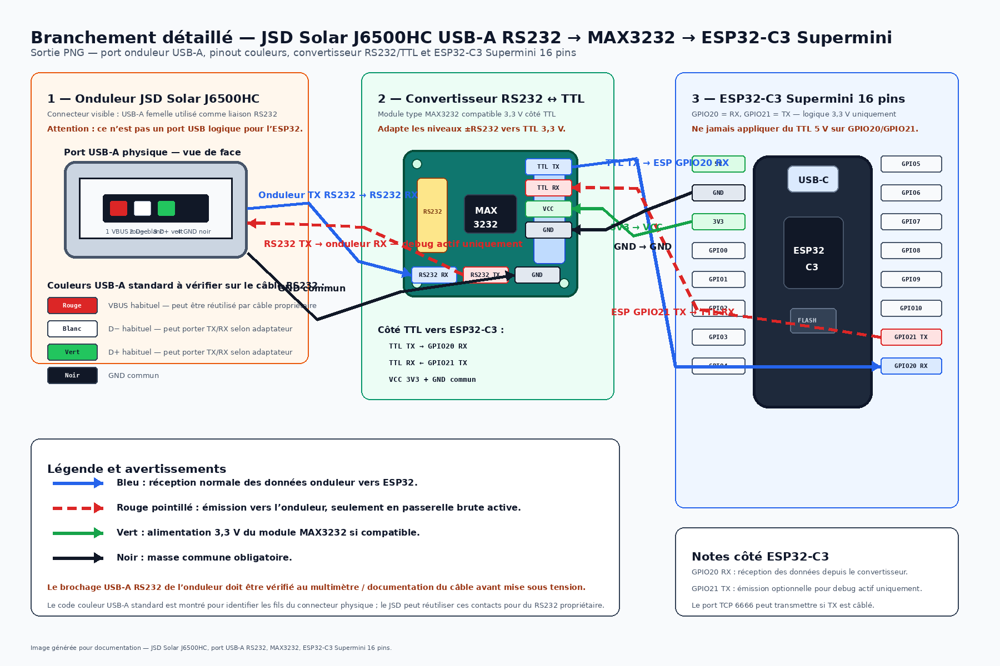

# Schéma de branchement — JSD Solar J6500HC / MAX3232 / ESP32-C3 Supermini

## Image générée

Fichier PNG :

```text
/root/.hermes/projects/esphome-jsdsolar-j6500hc/docs/assets/jsd-j6500hc-wiring.png
```

À intégrer dans un article Markdown :

```markdown

```

## Vue rapide


## Points représentés

- Port onduleur : **USB-A physique transportant du RS232**.
- Conversion obligatoire via **RS232/TTL type MAX3232**.
- ESP32 : **ESP32-C3 Supermini 16 pins**.
- Production/debug parser : `GPIO20 RX` uniquement.
- Passerelle brute active : `GPIO20 RX` + `GPIO21 TX`.
- GND commun.
- Alimentation recommandée du convertisseur : **3,3 V TTL** si le module MAX3232 l’accepte.

## Connexions principales

### Production / debug parser passif

```text
Onduleur RS232 TX -> entrée RS232 du MAX3232 -> TTL TX -> ESP32-C3 GPIO20 RX
GND onduleur / convertisseur / ESP commun
```

Aucun TX ESP vers onduleur.

### Passerelle brute active `debug-stream-gateway.yaml`

```text
Onduleur RS232 TX -> MAX3232 -> TTL TX -> ESP32-C3 GPIO20 RX
ESP32-C3 GPIO21 TX -> TTL RX -> MAX3232 -> onduleur RS232 RX
GND commun
```

Attention : dans ce mode, un client TCP connecté à `192.168.x.x:6666` peut envoyer des octets vers l’onduleur.

## Avertissements

- Le port USB-A de l’onduleur ne doit pas être branché directement sur les GPIO de l’ESP32.
- Le RS232 utilise des niveaux incompatibles avec l’ESP32.
- Ne jamais envoyer de TTL 5 V sur `GPIO20` ou `GPIO21`.
- Le brochage exact du port USB-A RS232 côté onduleur dépend du câble/adaptateur utilisé : vérifier TX/RX/GND avant mise sous tension.
